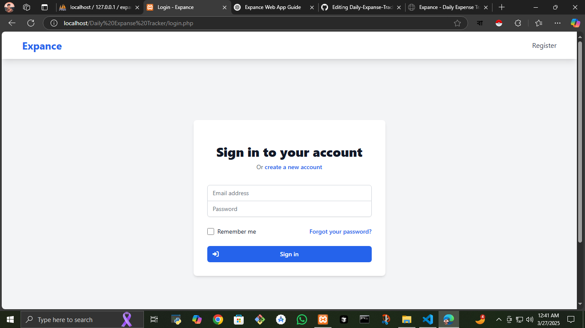
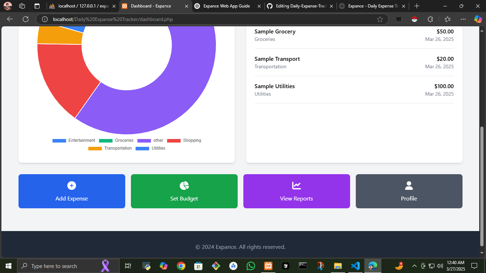
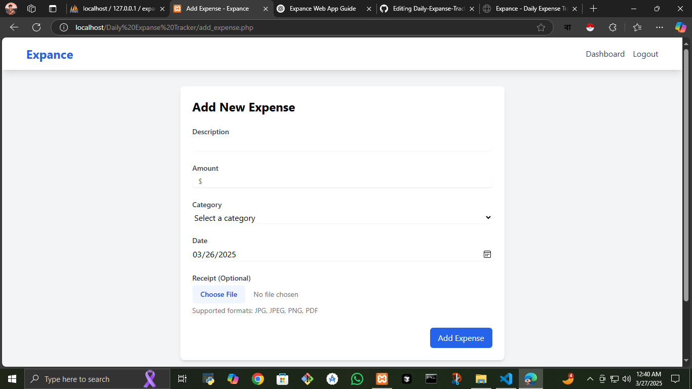
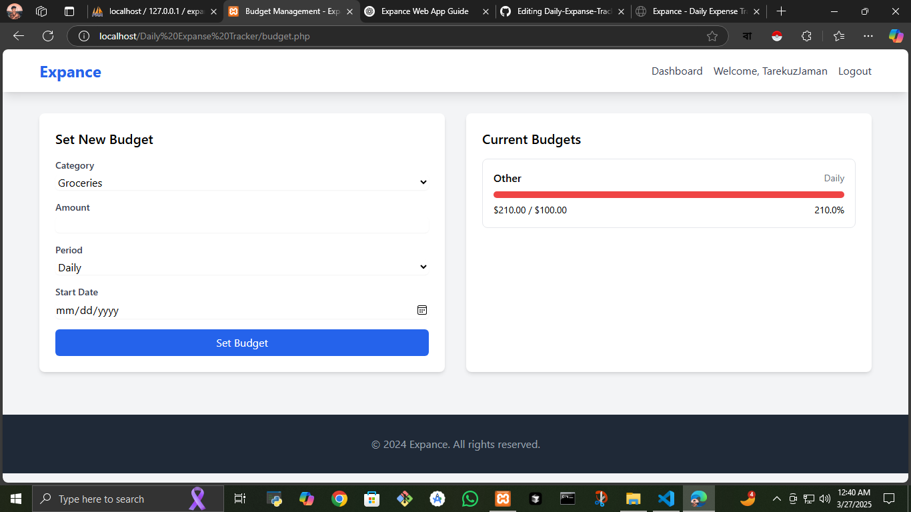
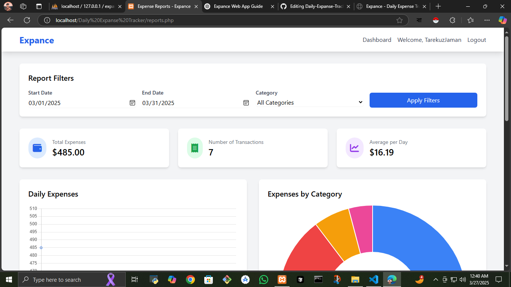

# Expance - Daily Expense Tracker

A modern web application for tracking daily expenses, managing budgets, and analyzing spending patterns.


- ## 📸 Screenshots










## Features

- 📊 Expense Tracking – Log and monitor daily spending
- 📑 Receipt Management – Save and organize receipts effortlessly
- 💰 Budget Planner – Set budgets and control your finances
- 📈 Smart Reports – Get insights into your spending habits
- 🎯 User-Friendly Interface – Simple, fast, and intuitive

## Additional Features

- 🔔 Smart Notifications
- 📱 Responsive Design
- 🔒 Secure Authentication
- 📊 Interactive Charts
- 📤 Export Data
- 💱 Multiple Currency Support

## Requirements

- PHP 7.4 or higher
- MySQL 5.7 or higher
- Web server (Apache/Nginx)
- Modern web browser

## Installation

1. Clone the repository:
```bash
https://github.com/Tarekuzjaman0/Daily-Expanse-Tracker.git
cd expance
```

2. Create a MySQL database and import the database structure:
```bash
mysql -u root -p < database.sql
```

3. Configure the database connection:
   - Open `config/database.php`
   - Update the database credentials if needed

4. Set up your web server:
   - Point your web server's document root to the project directory
   - Ensure the `uploads/receipts` directory is writable:
     ```bash
     mkdir -p uploads/receipts
     chmod 777 uploads/receipts
     ```

5. Access the application:
   - Open your web browser
   - Navigate to `http://localhost/expance`
   - Register a new account or use the default credentials


## Directory Structure

```
expance/
├── config/
│   └── database.php
├── uploads/
│   └── receipts/
├── js/
│   └── main.js
├── index.php
├── login.php
├── register.php
├── dashboard.php
├── add_expense.php
├── budget.php
├── reports.php
├── profile.php
├── logout.php
└── database.sql
```

## Security Features

- Password hashing using PHP's password_hash()
- Prepared statements for all database queries
- Input validation and sanitization
- XSS protection
- CSRF protection
- Secure session management

## Contributing

1. Fork the repository
2. Create your feature branch (`git checkout -b feature/AmazingFeature`)
3. Commit your changes (`git commit -m 'Add some AmazingFeature'`)
4. Push to the branch (`git push origin feature/AmazingFeature`)
5. Open a Pull Request

## License

This project is licensed under the MIT License - see the LICENSE file for details.

## Support

For support, email tarekuzjaman.dev@gmail.com or create an issue in the repository. 
